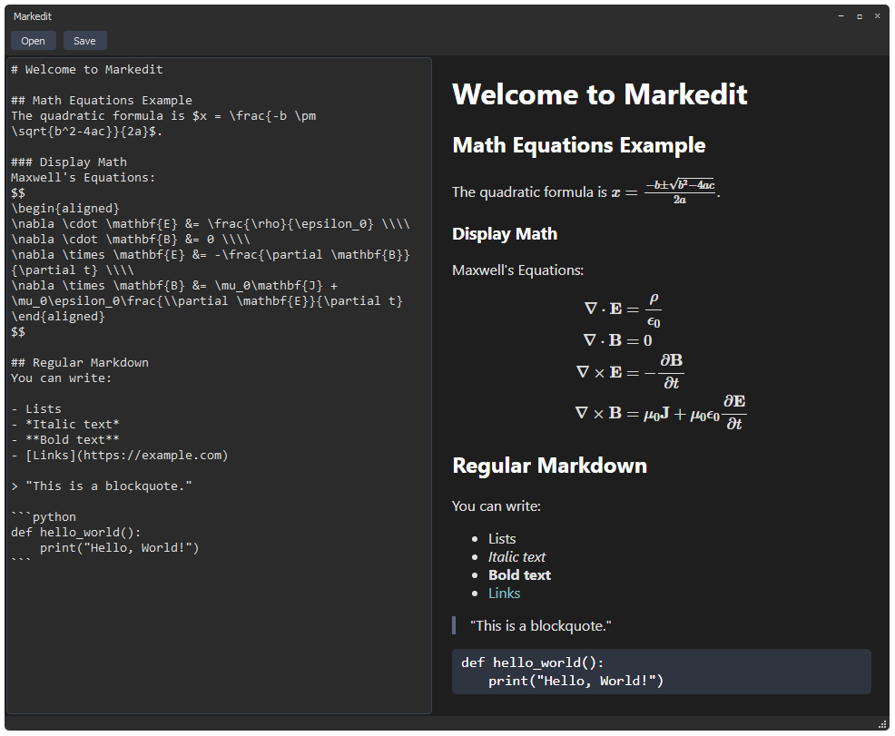

# Markedit

**A modern, minimalist Markdown editor with real-time preview and LaTeX math support.** The extremely minimal code-base allows for fast, easy customization and creating more complex apps on top of it (e.g. note-taking, blogging, etc.).



## Features
- 🎨 Clean, modern dark theme interface
- ⚡ Real-time preview as you type
- ✍️ Full Markdown support
- 📐 LaTeX math rendering (inline and display mode)
- 🖱️ Drag-and-drop window movement
- 💾 File operations (open/save)
- 🎯 Custom titlebar and controls
- 📏 Resizable split view

## Math Support
- Inline math using `$...$` or `\(...\)`
- Display math using `$$...$$` or `\[...\]`
- Powered by MathJax

## Installation
1. Clone the repository:

```bash
git clone https://github.com/QuentinWach/markdown-editor.git
```

2. Install the dependencies:
```bash
pip install -r requirements.txt
```

3. Run the application:
```bash
python main.py
```

---
Please leave a ⭐ if you found this useful!